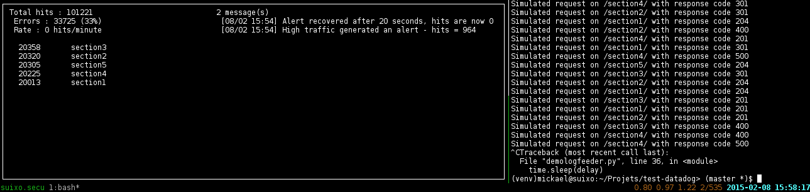

# HTTP log monitoring console program

## Usage

    python3 monitoring.py /var/log/apache2/access.log

You can generate fake log entries to test the program with `demologfeeder.py` :

    python3 demologfeeder.py -d 0.01 /tmp/demo.log

## Testing

### Installing coverage and py.test

    virtualenv venv --python=python3
    source venv/bin/activate
    pip install -r requirements.txt

### Running the tests

    coverage run --source='.' -m py.test tests

To read the coverage report :

    coverage report -m

## Initial instructions

Create a simple console program that monitors HTTP traffic on your machine:

* Consume an actively written-to w3c-formatted HTTP access log
* Every 10s, display in the console the sections of the web site with the most hits (a section is defined as being what's before the second '/' in a URL. i.e. the section for "http://my.site.com/pages/create' is "http://my.site.com/pages"), as well as interesting summary statistics on the traffic as a whole.
* Make sure a user can keep the console app running and monitor traffic on their machine
* Whenever total traffic for the past 2 minutes exceeds a certain number on average, add a message saying that “High traffic generated an alert - hits = {value}, triggered at {time}”
* Whenever the total traffic drops again below that value on average for the past 2 minutes, add another message detailing when the alert recovered
* Make sure all messages showing when alerting thresholds are crossed remain visible on the page for historical reasons.
* Write a test for the alerting logic
* Explain how you’d improve on this application design
